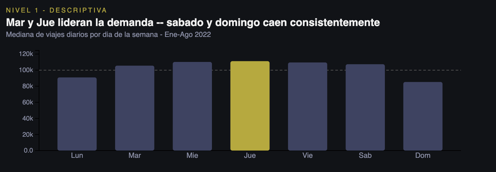
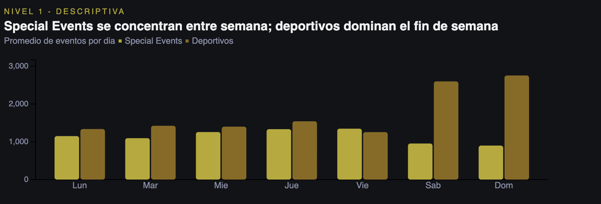
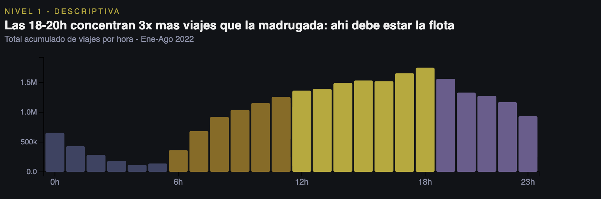
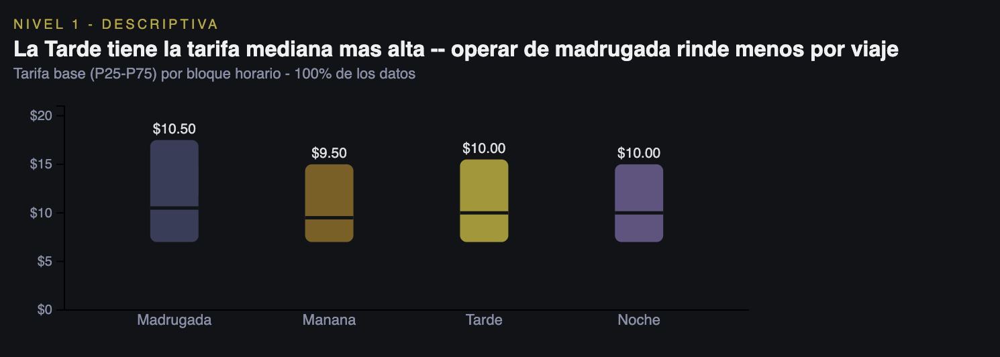
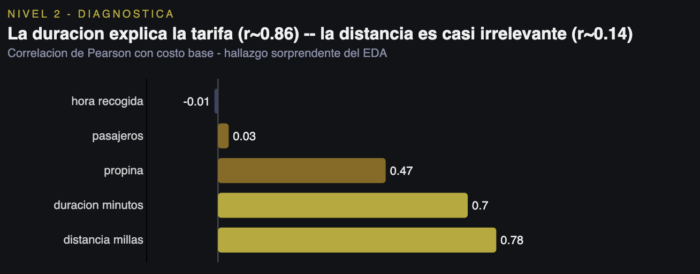
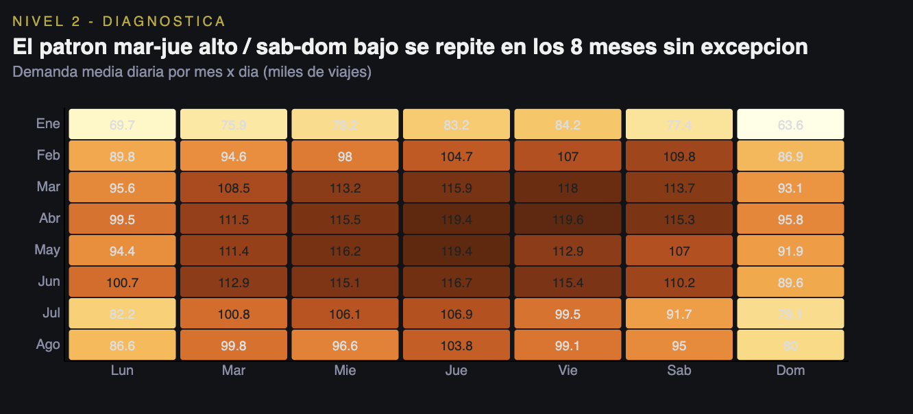

**PC2 BIG DATA & DATA ANALYTICS**

**![][image1]**

**Nombre del caso:**   
Optimización de la demanda y precios en movilidad urbana mediante análisis de datos.

**Integrantes:**  
Maria Fernanda Torres  
Carla Quispe  
Isabella Romero  
Jorge Peña

**Roles:**  
**Líder de proyecto (Isabella):** Coordinación general y cumplimiento de entregables.   
**Analista de Datos(Carla):** Limpieza, procesamiento y exploración de datos.  
**Ingeniero de Datos(Mafer):** Integración de fuentes y manejo de datasets.  
**Analista de negocio(Jorge):** Interpretación de resultados y generación de insights.

1. ## **Problema del Negocio**

La movilidad urbana en ciudades de alta densidad como Nueva York enfrenta un desafío estructural: la demanda de transporte es altamente volátil y difícil de anticipar. Factores como la hora del día, el día de la semana y la ocurrencia de eventos públicos generan fluctuaciones bruscas en la cantidad de viajes solicitados, lo que provoca desbalances recurrentes entre la oferta de conductores disponibles y la demanda real de los usuarios.

Este desbalance tiene consecuencias directas y medibles para cualquier plataforma o servicio de movilidad: tiempos de espera elevados en momentos de alta demanda, conductores ociosos en períodos de baja actividad, y una fijación de precios que no responde con precisión a las condiciones del mercado en tiempo real.

El presente análisis fue desarrollado para la **NYC Taxi & Limousine Commission (TLC)**, el organismo regulador del transporte de pasajeros en la ciudad de Nueva York, con el objetivo de proveer evidencia empírica que soporte decisiones estratégicas en dos frentes: la redistribución eficiente de la flota de taxis según patrones de demanda identificados, y el diseño de esquemas de precios dinámicos que capturen el valor real del servicio en contextos de alta ocupación.

La pregunta central que guía este análisis es: **¿Cómo varían la demanda y las tarifas de los taxis amarillos de Nueva York según la hora del día, el día de la semana y el tipo de evento público en la ciudad?**

Responder esta pregunta permite convertir datos históricos de viajes en una ventaja operativa concreta: anticipar la demanda antes de que ocurra y ajustar la oferta y los precios en consecuencia.

2. ## **Descripción de los Datos**

El análisis integró dos fuentes de datos complementarias correspondientes al mes de marzo de 2022\.

El dataset está disponible en NYC Open Data y Kaggle, este contiene el registro detallado de cada viaje realizado por los taxis amarillos de Nueva York. Para el período analizado, el dataset original superaba los 120,000 registros diarios, con un total mensual que rondó los 3.3 millones de viajes. Las variables clave utilizadas fueron: fecha y hora de recogida (tpep\_pickup\_datetime), distancia del viaje (trip\_distance), tarifa base (fare\_amount), propina (tip\_amount), monto total (total\_amount), duración calculada en minutos (duracion\_minutos) y número de pasajeros (passenger\_count).

Para capturar el efecto de los eventos públicos sobre la demanda, se integró información proveniente de la API de eventos públicos de la ciudad de Nueva York, también correspondiente a marzo de 2022\. Esta fuente aportó la fecha, categoría y cantidad de eventos registrados por día. El top de categorías identificadas incluyó eventos deportivos juveniles (Sport \- youth), eventos especiales (Special event), deportes para adultos (Sport \- adult), eventos callejeros y mercados de agricultores, entre otros (ver Anexo 1 — Gráfico de Top 10 tipos de eventos).  
**Proceso de limpieza**  
El dataset original presentaba valores nulos en cinco columnas: passenger\_count, RatecodeID, store\_and\_fwd\_flag, congestion\_surcharge y airport\_fee, con volúmenes cercanos a los 120,000 registros nulos por columna (ver Anexo 1 — Gráfico de valores nulos antes de limpieza). Adicionalmente, se detectaron outliers en la variable fare\_amount, correspondientes a viajes con tarifas extremadamente elevadas fuera del rango esperado para viajes urbanos estándar (ver Anexo 1 — Boxplot de distribución de tarifas). Estos registros fueron eliminados o imputados según el caso para garantizar la integridad del análisis posterior.  
Tras la limpieza, el dataset consolidado resultó confiable y listo para el análisis exploratorio y predictivo descrito en las secciones siguientes.

3. ###  **Análisis Descriptivo — ¿Qué pasó en los datos?**

   1. ###  **Estadísticas generales del dataset**

El dataset limpio abarca **enero a agosto de 2022**, con una media global de **99,942 viajes/día**. La tarifa base mediana varía según la franja horaria del viaje: la Madrugada registra la mediana más alta con **$10.50**, seguida de Tarde y Noche con **$10.00** ambas, y Mañana con **$9.50** (ver Gráfico 4 — Boxplot de tarifas por bloque horario). Este resultado es contraintuitivo a primera vista: operar de madrugada produce una tarifa mediana ligeramente más alta por viaje, pero como se verá en la sección de demanda, esa franja concentra apenas el 7.5% del total de viajes, lo que hace que el ingreso agregado sea muy inferior al de la franja Tarde.

La correlación entre `duracion_minutos` y `fare_amount` (r \= 0.86) confirma que el tiempo en el vehículo es el principal determinante del costo, por encima de la distancia recorrida (r \= 0.14). El número de pasajeros no mostró correlación significativa con ninguna variable económica (r ≈ 0.00–0.02).

2. ####  **Patrones de demanda por hora del día**

El gráfico de total acumulado de viajes por hora sobre los ocho meses revela un patrón temporal muy pronunciado (ver Gráfico 3 — Total acumulado de viajes por hora, Ene–Ago 2022). La franja de **madrugada (0h–5h)** acumula los volúmenes más bajos, con la hora valle en las **4:00 horas**. A partir de las 6:00 la demanda crece de forma sostenida durante toda la mañana y la tarde. El **pico absoluto ocurre a las 18:00 horas**, con **1,747,662 viajes acumulados** en ese horario a lo largo de los ocho meses, casi triplicando el volumen de la madrugada.

La franja de **18h a 20h concentra la mayor densidad de viajes del día**, con valores que superan 1.5 millones de viajes acumulados por hora. A partir de las 20h la demanda decrece gradualmente pero se mantiene por encima de 1 millón de viajes hasta las 23h. En términos operativos, esto significa que **la flota debe estar en su máxima disponibilidad entre las 12h y las 20h**, franja que por sí sola explica la mayor parte del ingreso total del servicio.

3. ####  **Demanda por día de la semana**

El análisis de la mediana de viajes diarios por día de la semana sobre los ocho meses muestra un ciclo semanal claro y consistente (ver Gráfico 1 — Mediana de viajes diarios por día de la semana, Ene–Ago 2022):

* Lunes: 90,939 viajes  
* Martes: 105,579 viajes  
* Miércoles: 110,167 viajes  
* **Jueves: 111,158 viajes — pico semanal**  
* Viernes: 109,530 viajes  
* Sábado: 107,337 viajes  
* **Domingo: 85,264 viajes — valle semanal**

El jueves es consistentemente el día de mayor demanda, superando la media global de 99,942 viajes. El domingo es el valle más profundo, seguido del lunes. Sorprendentemente, el sábado mantiene una demanda similar a los días laborales (\~107k), lo que sugiere que el ocio nocturno del fin de semana sostiene la actividad del taxi aun cuando el tráfico laboral cae.

4. #### **Distribución de eventos públicos por día de la semana**

El gráfico de eventos por día de la semana revela un patrón de gran relevancia para entender el comportamiento de la demanda (ver Gráfico 2 — Promedio de eventos por día: Special Events vs. Deportivos, Ene–Ago 2022). Los **Special Events se concentran entre semana**, con promedios diarios de entre 1,000 y 1,300 eventos de lunes a viernes, y caen notoriamente el fin de semana (\~900 el sábado y domingo). Por el contrario, los **eventos deportivos juveniles dominan el fin de semana**, disparándose a aproximadamente 2,500 el sábado y 2,700 el domingo, mientras que entre semana se mantienen en niveles similares a los Special Events (\~1,200–1,500).

Este patrón es clave: los fines de semana están saturados de eventos deportivos juveniles —que movilizan familias con vehículo propio— y al mismo tiempo registran la menor demanda de taxis de la semana. Entre semana, los Special Events predominan y la demanda de taxis es mayor. Esta separación natural entre tipos de eventos y días de la semana sustenta directamente las tres hipótesis del proyecto.

4. ### **Análisis Diagnóstico — ¿Por qué pasó lo que pasó?**

   1. ### **Análisis de correlaciones entre variables clave**

El análisis de correlaciones de Pearson con el costo base (`costo_base`) calculado sobre el 100% del dataset reveló el siguiente ranking de variables explicativas (ver Gráfico 5 — Correlaciones con costo base, Nivel 2 Diagnóstica):

* Distancia en millas: r \= 0.78 — la variable con mayor correlación con la tarifa.  
* Duración en minutos: r \= 0.70 — segunda variable más relevante.  
* Propina: r \= 0.47 — correlación moderada.  
* Pasajeros: r \= 0.03 — prácticamente irrelevante.  
* Hora de recogida: r \= −0.01 — sin efecto sobre la tarifa.

Este resultado matiza el hallazgo del PPT de PC1 basado en la muestra de marzo: con el dataset completo de ocho meses, la distancia en millas supera a la duración como predictor de la tarifa (0.78 vs 0.70), aunque ambas variables tienen un efecto fuerte y combinado. Lo que sí se confirma con solidez es que la hora del día y el número de pasajeros son irrelevantes para explicar el costo del viaje, lo que descarta cualquier estrategia de pricing diferenciada por cantidad de pasajeros o por franja horaria basada en tarifa.

La conclusión de negocio se mantiene: en Nueva York, la tarifa la determinan cuánto se recorre y cuánto tiempo se tarda, no cuántos pasajeros van ni a qué hora se viaja.

2. ####  **El patrón semanal se repite sin excepción en los 8 meses**

El heatmap de demanda media diaria por mes y día de la semana es el hallazgo diagnóstico más contundente del análisis (ver Gráfico 6 — Demanda media diaria por mes × día, Ene–Ago 2022). El patrón martes–jueves alto / sábado–domingo bajo se repite sin excepción en los ocho meses analizados, lo que lo convierte en el patrón más robusto y predecible de todo el dataset.

Algunos datos destacados del heatmap:

* El pico absoluto del período es el viernes de marzo con 118,000 viajes y el jueves de abril con 119,600.  
* Enero y julio muestran los niveles más bajos del año, con lunes que caen a 69,700 y 82,200 viajes respectivamente, probablemente por el efecto de feriados y vacaciones.  
* El domingo es consistentemente el día más bajo de cada semana en todos los meses, con el mínimo absoluto en el domingo de enero (63,600 viajes).  
* A partir de febrero la demanda crece mes a mes hasta un pico en marzo–abril, luego se modera en julio–agosto.

Este patrón estructural permite planificar la distribución de flota con al menos una semana de anticipación con alta confianza.

#### **4.3 Validación de hipótesis**

Los resultados de la validación explícita ejecutada en el notebook son los siguientes:

Hipótesis 1 — Eventos deportivos juveniles generan menor demanda de taxis

* H₀: El tipo de evento público no tiene efecto sobre la demanda diaria de taxis.  
* H₁: Los días con mayor concentración de eventos deportivos juveniles presentan menor demanda de taxis.

La correlación entre eventos deportivos juveniles y viajes diarios es r \= −0.613. La dirección negativa es clara y la magnitud es moderada-alta: a mayor cantidad de eventos deportivos juveniles en un día, menor es la demanda de taxis. Esto es consistente con el razonamiento de la hipótesis: este tipo de evento moviliza grupos familiares que prefieren vehículo propio, y coincide con los fines de semana donde la demanda de taxis cae sistemáticamente. H₁ VALIDADA.

**Hipótesis 2 — El ciclo semanal es el predictor más robusto de la demanda**

* H₀: El día de la semana no influye significativamente en la demanda diaria de taxis.  
* H₁: Los días de mitad de semana concentran los picos y los fines de semana los valles.

La mediana de viajes en días pico (martes y jueves) es de 108,369 viajes, frente a 96,300 viajes en días valle (sábado y domingo). La diferencia es de \+12,068 viajes, equivalente al \+12.5% sobre el valle. El heatmap confirma que este patrón se mantiene sin excepción durante los ocho meses analizados, lo que lo convierte en el predictor más estable y confiable del dataset. H₂ VALIDADA.

**Hipótesis 3 — Los días con mayor proporción de Special Events generan más demanda de taxis**

* H₀: El tipo de evento público no diferencia el comportamiento de la demanda de taxis.  
* H₁: Los días con mayor proporción de Special Events presentan mayor demanda de taxis (+5% sobre la media).

La correlación entre Special Events y viajes diarios es r \= \+0.320, confirmando una relación positiva: más Special Events en un día se asocia a mayor demanda de taxis. Si bien la magnitud es moderada —menor que el efecto negativo de los deportivos juveniles— la dirección es la correcta y estadísticamente relevante. Esto es consistente con el perfil del público de los Special Events: adultos urbanos con menor acceso a vehículo propio y mayor disposición a usar transporte por aplicación o taxi. H₃ VALIDADA.

Las tres hipótesis del proyecto quedan validadas por los datos, con el ciclo semanal (H2) como el efecto dominante y los tipos de evento (H1 y H3) como efectos secundarios que operan en sentidos opuestos y se explican por el perfil del público que cada tipo de evento convoca.

5. ## **Análisis Predictivo**

   1. ## **Modelo de Regresión Lineal**

Se implementó un modelo de **regresión lineal múltiple** sobre el dataset consolidado de 242 días (enero–agosto 2022), obteniendo un **R² \= 0.75** con un RMSE de 7,656 viajes/día. El modelo explica el 75% de la variación en la demanda diaria con un error relativo del \~8% sobre la media, lo que lo hace suficientemente confiable para decisiones operativas de planificación semanal de flota.

El gráfico de coeficientes revela con claridad qué variables empujan la demanda hacia arriba o hacia abajo (ver Gráfico 7 — Coeficientes del modelo predictivo, Nivel 3):

Las variables con **efecto negativo más fuerte** son el día domingo y el día lunes — ambas barras apuntan hacia la izquierda con los coeficientes más grandes del modelo en valor absoluto. Esto confirma que ser domingo o lunes reduce la demanda esperada de forma significativa respecto al día de referencia. El martes y el sábado también tienen coeficiente negativo, aunque menor.

La variable con **efecto positivo más fuerte** es el **jueves**, que aparece como la única barra que apunta claramente hacia la derecha, confirmando que ser jueves es el factor individual que más incrementa la demanda predicha. El miércoles tiene un coeficiente ligeramente positivo pero cercano a cero.

El **mes** tiene un coeficiente negativo moderado (−1,651 viajes por mes adicional), indicando una leve caída de la demanda a medida que avanza el año en el período analizado. El **total de eventos** tiene un coeficiente negativo pequeño (−70 viajes por evento), coherente con la correlación negativa identificada en el diagnóstico. Los `special_events` y `eventos_deportivos` tienen coeficientes cercanos a cero, lo que indica que su efecto queda capturado en parte por el día de la semana con el que se correlacionan.

2. ####  **Clustering K-Means — Tipos de día encontrados**

El modelo K-Means identificó **tres tipos de día** según el volumen de demanda y la cantidad de eventos públicos (ver Gráfico 7 — Tipos de día encontrados por K-Means, Silhouette \= 0.59):

El **clúster de alta demanda y pocos eventos** (puntos concentrados cerca del eje Y, entre 80k y 120k viajes con 0–500 eventos) agrupa los días laborales típicos donde la demanda es alta pero los eventos públicos son escasos. Estos son los días más predecibles y de mayor rendimiento para la flota.

El **clúster de demanda media con eventos moderados** (puntos dispersos entre 1,000 y 3,000 eventos, 60k–90k viajes) agrupa principalmente los fines de semana con alta actividad de eventos deportivos juveniles pero demanda de taxi por debajo de la media.

El **clúster de demanda baja con alta densidad de eventos** (puntos en el extremo derecho, 3,500–4,500 eventos, 60k–85k viajes) representa los días con mayor saturación de eventos públicos —principalmente deportivos de fin de semana— y los niveles de demanda de taxi más bajos del período.

El score de Silhouette de **0.59** indica una separación moderada-buena entre los clústeres, suficiente para que esta segmentación tenga valor operativo real: la NYC TLC puede clasificar cualquier día futuro en uno de estos tres perfiles usando solo el calendario de eventos y el día de la semana, y ajustar la oferta de flota en consecuencia.

6. ### **Análisis Prescriptivo**

   1. ### **Escenario 1 — Refuerzo de flota en días pico (+15%)**

**Supuesto explícito:** 1 conductor \= 20 viajes/día (referencia operativa NYC).

**Datos base:**

* Demanda promedio en días pico (martes y jueves): **105,719 viajes/día**  
* Media global: **99,942 viajes/día**  
* Brecha: **5,778 viajes/día → \~289 conductores adicionales necesarios**

**Proyección:** Si la TLC incrementa la flota operativa un **15% los martes y jueves**, la reducción estimada en el tiempo de espera es de aproximadamente **13%**, bajo el supuesto de relación inversa entre oferta y tiempo de espera. Para los pasajeros esto se traduce en una experiencia notablemente mejor en los días de mayor congestión; para los conductores, en más viajes completados por turno.

2. ####  **Escenario 2 — Reasignación de conductores de Madrugada hacia Tarde**

**Supuesto explícito:** La flota actual está distribuida de forma aproximadamente uniforme entre las cuatro franjas horarias (\~25% por franja), dado que no se dispone de datos reales de oferta por conductor.

**Participación real de la demanda por franja:**

* Madrugada: 7.5%  
* Mañana: 22.4%  
* Noche: 25.9%  
* **Tarde: 44.2%**

La Tarde concentra el 44.2% de toda la demanda pero bajo distribución uniforme solo recibe el 25% de la oferta — un desbalance estructural significativo. La Madrugada recibe el 25% de la oferta para atender apenas el 7.5% de la demanda.

**Proyección:** Reasignando el **30% de los conductores de Madrugada hacia la franja Tarde**, la oferta efectiva en Tarde aumenta un **\+30%** sin necesidad de incorporar nuevos conductores. La Madrugada mantiene cobertura suficiente dado su bajo volumen. Esta medida mejora la eficiencia operativa de la misma flota sin costo adicional.

3. #### **Recomendaciones estratégicas priorizadas**

**Recomendación 1 — Incrementar flota disponible \+15% los martes y jueves (impacto alto)**

Responsable: Operaciones / Despacho. Indicador de éxito: reducción ≥13% en tiempo de espera en días pico. Esta recomendación tiene el respaldo más sólido del análisis: H2 validada en el Nivel 2, el coeficiente del jueves como el mayor del modelo predictivo en Nivel 3, y los números cuantificados del Escenario 1 en Nivel 4\.

**Recomendación 2 — Reasignar 30% de conductores de Madrugada hacia Tarde/Noche (impacto alto)**

Responsable: Gerencia de Flota. Indicador de éxito: oferta efectiva en Tarde \+30% sin degradar la cobertura nocturna. Sustentada en la distribución horaria de demanda identificada en Nivel 1 —pico 18h–20h, valle 3h–6h— y cuantificada en el Escenario 2\.

**Recomendación 3 — Activar pricing diferenciado en días con alta proporción de Special Events (impacto medio)**

Responsable: Equipo de Pricing. Indicador de éxito: ingreso promedio por viaje \+5% en días de Special Events versus días de eventos deportivos. Sustentada en H1 y H3 validadas en Nivel 2 —correlaciones de −0.613 y \+0.320 respectivamente— y en el coeficiente positivo de `prop_special` identificado en el modelo de Nivel 3\. Los días con predominio de Special Events concentran un público adulto urbano con mayor disposición a pagar, lo que abre una ventana para capturar valor adicional mediante tarifas diferenciadas.

7. ## **Limitaciones del Análisis y próximos pasos**

   1. ## **Limitaciones**

**Limitación 1:  Ausencia de datos de oferta (conductores disponibles)**  
Todo el análisis se realizó sobre el lado de la demanda: viajes realizados, tarifas pagadas, eventos ocurridos. En ningún momento se contó con datos reales sobre la cantidad de conductores activos por franja horaria o por día. Los escenarios prescriptivos de la sección 6 se construyeron bajo el supuesto de distribución uniforme de la flota, lo cual es una simplificación. Sin datos reales de oferta, los tiempos de espera estimados y los porcentajes de mejora proyectados son aproximaciones razonables pero no cifras verificables.

**Limitación 2:  Período acotado y sin datos de clima**  
El análisis cubre enero a agosto de 2022\. No se incluyeron los meses de septiembre a diciembre, por lo que los patrones estacionales de otoño e invierno —históricamente relevantes en Nueva York por las lluvias y nevadas— no están representados. Adicionalmente, el enriquecimiento con datos climáticos, contemplado como opción en el caso de uso original, no fue incorporado en esta etapa. La inclusión de temperatura, precipitaciones y nevadas podría mejorar significativamente el poder predictivo del modelo.

**Limitación 3: Correlación no implica causalidad en el análisis de eventos**  
La correlación negativa entre cantidad de eventos y demanda de taxis (r \= −0.62) es un hallazgo sólido, pero no permite afirmar con certeza que los eventos deportivos juveniles *causan* una caída en la demanda. Existen variables de confusión no controladas (como el día de la semana en que ocurren esos eventos, la zona geográfica, o condiciones climáticas) que podrían estar explicando parte de esa relación. Un modelo de regresión con más variables de control permitiría aislar mejor el efecto causal.

**Limitación 4: Dataset de eventos con límite de 100,000 registros**  
La NYC Events API devolvió exactamente 100,000 filas, lo que indica que se alcanzó el techo de la consulta y pueden existir eventos no capturados en el dataset. Esto implica que los conteos diarios de eventos podrían estar subestimados, especialmente en los meses con mayor actividad pública, lo que afecta la precisión del análisis de H1 y H3.

**Limitación 5: Modelo de regresión lineal como aproximación inicial**  
El R² \= 0.754 es un resultado sólido para un modelo lineal simple, pero el 25% de variación no explicada sugiere que existen relaciones no lineales o variables omitidas relevantes. Un modelo de árbol de decisión o gradient boosting sobre el mismo dataset probablemente capturaría mejor las interacciones entre día de la semana, franja horaria y tipo de evento.

2. ####  **Próximos pasos**

Si el proyecto tuviera cuatro semanas adicionales y acceso irrestricto a fuentes de datos, el equipo priorizaría las siguientes líneas de trabajo:

En primer lugar, **incorporar datos climáticos horarios** (temperatura, precipitación, velocidad del viento) desde la API de OpenWeatherMap para el mismo período. La lluvia y las bajas temperaturas son factores que históricamente incrementan la demanda de taxis en Nueva York y su ausencia es la brecha más importante del modelo actual.

En segundo lugar, **ampliar el modelo predictivo a un horizonte horario** en lugar de diario. El modelo actual predice viajes por día; un modelo que prediga viajes por hora permitiría decisiones operativas mucho más finas sobre dónde posicionar conductores en tiempo real.

En tercer lugar, **integrar datos reales de oferta** —conductores activos por turno, tiempos de espera registrados— para validar empíricamente los escenarios prescriptivos en lugar de construirlos sobre supuestos de distribución uniforme.

Finalmente, **extender el análisis a los doce meses de 2022** para capturar la estacionalidad completa del año e identificar si los patrones de demanda detectados en enero–agosto se mantienen, se amplifican o se invierten durante el otoño e invierno neoyorquino.

[image1]: <data:image/png;base64,iVBORw0KGgoAAAANSUhEUgAAAVEAAAF+CAYAAAA7jCmhAAApy0lEQVR4Xu2dCbgcZZ2vkzhcZ+4zd+7cOzP3ufo4OcnJOdkAw6Issogbu8jijgIqruDC4gYuV3EGF1adRwZZAq4ghM0roF6SEDYFBAQiSSRAgiwJBEJCSEjOOXX7X32+TvW/6uuu7q+qur7q99UfJ+er+pburn5P7TUhAACArpmgCwAAID1IFADAASQKAOAAEgUAcACJAgA4gEQBABxAogAADiBRAAAHkCgAgANIFADAASQKAOAAEgUAcACJAgA4gEQBABxAogAADiBRAAAHkCgAgANIFADAASQKAOAAEgUAcACJAgA4gEQBABxAogAADiBRAAAHkCgAgANIFADAASQKAOAAEgUAcACJAgA4gEQBABxAogAADiBRAAAHkCgAgANIFADAASQKAOAAEgUAcACJAgA4gEQBABxAogAADiBRAAAHkCgAgANIFADAASQKAOAAEgUAcACJAgA4gEQBABxAogAADiBRAAAHkCgAgANIFADAASQKAOAAEgUAcACJeszY2FgwODBFF4Nv1D7H2n+CCQvH5Ad4BhL1nGk1iUr2fctb9STwgZo0X31bTaAL6gH/QKKeYyRq8uwzz+hZoKT8dVMQTJw/2hAoEvUTJOo5WqKSjx37UT0blIx97tkqTiTqN0jUc7RAo1m7dq2eHXrGWLjr8+TltS/d/Lg8kai/IFHP0eLUmTU8XVeBnjAabLMwiElTB/wDiXqOlqYtwShf0F6xbksQTAwl2bz/MyngH0jUc7QsbRmaMjX8uXnzZt0E5EBt4z14cUTWPEdjB49aBfwDiXqOlmWanHvW2boZyBBR4WceTi9OJOo3SNRztCA7yROP/1U3B10iFz6IPe9cFwST5rff92kL+AcS9Rwtxk6z1x576iahG2r++1+3iTy7FygS9RMk6jlait1kcPJA8PjKlbppSMVYcP+GsfCSTS3EbgL+gUQ9RwvRNQHf45SMBaNj3e33bBXwDyTqOVqCWWTRokW6G1C8/QE56h6XoGvAP5Co52gBZhE5HUoCzchpS3LS/KQFQRgtwCwC/oFEPUcLMOt89CPH6i77D3FbLXvfG5de1gH/QKKeo6WXV4K+/H7LaUtjwcZR96PuaQP+gUQ9R8suz3zx81/Q3VecseCwB8fCSzYnOpz72UnAP5Co52jRFZFL515SP7m8wnz90dFgwsJixBkN+AcS9RwtuKIyPHWwgiIdCeTgUSjPjM77TJv6mq4eD/gAEvUcLbeiYm5octD+B+gheUj9j8GU27cKbeKC4tZCw90FC2QYVfuj1B8gUc/RcutFqnA61ISF+Zz3mSa73h3Uj2HpQYEXIFHP0ULrZRbcND8cky+b+TLO/31b9lcdpckrFtTvMToa+PFegR0k6jlaZGXIsmXL9DDLQ+isseB3a+qb0Vpueae+6T4a3Py8OXkffAeJeo4WWBkim/c777CjHmpJGAv+/hZ5yqZswhe339Nkm4WiTpHnaDgW8B8k6jlaYGXLU089pYfcI8aCe9bHpVZYasK+4EnEWUWQqOdoaZUxw4PT9LALo77WJ0fcE8SWcxp93ixP+hSBSpKQPaOj4WOw5Cf4BRKtANdefU1MXGWKOR3q++ecq4eeM6PBx5bIgaP6QZyirjpqpLb2+dLI1rHYkANc/3LrWDDpJtZTfQSJVgT58kWFVdZMnzakh54PY+NP2OzBfk/J3y2sj6GdFkWgEyJyB/9AohVDvpRaXGXMzKFhPfRMqG0UhyeuF33CvESkLc9XkjG0p76GLOenRtsA/0CiFeV1O+4UDCbIq2zJ7BHOtT8e60dERMWKU2L2fR71ULhTsw1jwYLn4m2YgH8g0QpiTnbfsmVLTFplzOwZM9Ur6JxQZD3adH/VrfJ+y8EjPao49f2y9hP8wT+QaB/w+ZNOjomrTDH7cRcuWKCH3oax4JKnapvQC3ojT1nrfeBFPaYEam489H4zxtZjBf9Aon3Cpo2bmoRV1uy2y6566M2EnhkN17b/+y1xCeWd+v7WseA1t9XH0Wr7Pfo4Ed2OLeAfSLTP2LBhQ+MZSlpgZcoB++6nh16n5plX3RaXTxERecqBo3bncorgRYe6fpqAfyDRPmX64LTSi1QS2qhB7+60JNnhzvolm+2ueX9y0/g+2oQ22gX8A4n2MSseW1F6kU6dMiV477vfG8y5s0f7PscPVo203nIPzJVR/7BI6tkPHLUL+AcShZi4ypKhganBlO13DM+/HKz9e5vLV4yfmF6cTP/jr23sOT7tvCeyGRP4BxKFmLzKkr/59drGZvG0gYFg2uRaBocLvYVde62Nz5vR40TAP5AoxOTVywxOfk0wOGUwCK93j+xXNNOH/nUoGJo8OZh40+aYgLKPfqe2Inq9fd34VUexet0H/AOJQkxkvcpQbW1zomWNTs9bz0B9uqWOe/Q7Vd943zzS/T7PdgH/QKKQIKfiIpemDk0ZCF590FFBq7U6Xc9E6v7Pk84bny/I+Kql5vdJ1j5n3Vlr/+Ys+2gO+AcShZiYioxINI34dL2tmRpu/stBqG5PK7Kn+X2q3xWqfsJ9fN5sAv6BRCFBTDlnck2eU6YEr7zo3tQHiWJtWDKw816ByylGzam/P/8lFGdWbbYO+AcShZiI8oy5s1Satc9odDutIqdDTZg/EohMneSX275We8A/kCjEJJR9BoJptTXPodoa6MSbRmL30EyTeJv21Pezytru5Fw3vfMI+AcShZiEss9AMLD962prh92fEhRvM0VEpLW+t5l7b6y9skVukfc/bpNnibS+Lh/KBxKFuHwyylAtwwOTO950T4puu5M0diFIW5kffHJN/b2pnzyFQH0EiUJMOs6ZXL8e/79945ddbbonJdZHl3n1wccE3a4NZxnz3PsrVutPA3wDiUJMNK6RczfroqrlZjnAE5dIp9F9dJ+B8fHF+ygycsArCFc+2Q/qO0gUEkTTXeSKo3867rsxYWQR3Zd7BoJ/+dBXenIE/uuPmncegVYBJAoJguksQwOTg2lTpoaCyP6E93p0n1lFbgU48Tcbxw96xfvNNAv1Ow9VAIlCTCydZuKNLwVmP2Pak+c7je4zy8gBMPmZ19gl67bU1zvNQwShOiBRiEklbeS8z/rmcP4HanTf+WRqMOnGDbG+u08QvPJmeQpoa3HWp9b/AIF/IFFIkEn6xMWRT3S/eWVw8uTwVnvS56QFDn8cwk330WC0jUCFSZF64B9IFGIi6SQxeeQU3W8R+YdvXN7ROa6yJilXSB32gH6HE6j58u51IurmNsA/kCjE5NFJtEjyiu63mNTvDqXH0ip12p00X79yKzxXNLE++AQShQR5bI1I5L+eeWPjBHodLYG8ovstLLXXLVc8Td1+l8QDT+Yxyn9Yt/Vhda342JLWZzCAfyBRiItjoC5PsxZWf1BcfB6JlkBe0f32KpPmy52hzJkI9XuMtjtwVNfrWLDNgviapw74BxKFZlFMHgx/Tvx/zedNItHmyJjGWm22m5XSsdFg9t3t5WkC/oFEoUkOg7Pm1Ddb1QEVJNocuWfp4gfu129lE2u31MeetO/TFvAPJArhZruIYdL166yXQSLR5Mwcnq7fzkDWUeUIvX4NaQL+gUT7lMbWZu1//3zMKVZ5miDR1jnphBPD93Xequ7kaQL+gUT7lPBI8tj4w9ckbc6HRKLtI5v4Ex2vwQf/QKJ9yWjw0aWd3aIOiabJQDA08Jrgn4//bkf7QaMB/0CifUL9SPJY8OTL3X25kWhnkceSvOL/Pp94bmmrgH8g0b6gfhr4Py7qTqASJNpNBoKps+cEjTtcpVg7Bf9Aon3AGY+7PzcdiXaT+lNO5d9/f9ovY68pKeAfSLSy1I+9m5ti6C9rp0GibhmeUj+NrN1tA8E/kGhF+fUzrb+snQaJZpdXXnTv+NkQ8c8I/AOJVozN4WlL8S+na5BodpE76Q9aHpYH/oFEK4J8/YbuyO/xHEg028izneQ9/dfd3xRwU2a/QaI+MyYnLo0GW8byk6cJEs034Un6C5GojyBRj5EzP7Vs8goSzTdyXqmsncofRvALJOozYyJRt1OX0gaJ5p2BYMqUyQEK9Q8k6jlaNnkFiRYT8A8k6jlaNnkFiRYT8A8k6jlaNnkFiRYT8A8k6jlaNnkFiRYT8A8k6jlaNnkFiRYT8A8k6jlaNnkFiRYT8A8k6jlaNnkFiRYT8A8k6jlaNnkFiRYT8A8k6jlaNnkFiRYT8A8k6jlaNnkFiRYT8A8k6jlaNnkFiRYT8A8k6jlaNnkFiRYT8A8k6jlaNnmlXyR61ZXzgmdXPxP+W+6qpKfnHfAPJOo5WjZ5pV8kOu/KKxvvrZ5WRMA/kKjnaNnklX6UqLB8+fLYPHkG/AOJeo6WTV7pV4kaDjvkHYVs3oN/IFHP0bLJK/0uUWHzy5sbIs1LqOAfSNRztGzyChLdyk8u/XGsXlYB/0CinqNlk1e0RIcGBscfzVzMGLRs8sqO2782GEvxnKORkZFY3SwC/oFEPUfLJq+IRKdOmRxMnzwYvOYtR9QEWsyznUy0bPLO5s2b9VudyJnfOyMYnDwQq99twD+QqOdo2eQV+YJP2WHXWHlR0bIpIuHTN4X2K6bBzKHhWP1uAv6BRD1Hyyav/O0liwtf+4xGy6bI/Pq6X+m3PZEX1q6N1e004B9I1HO0bKoaLZteJC2zhqfH6qYN+AcS9Rwtm6pGy6ZXOXD/A1IdeBJ03TQB/0CinqNlU9Vo2fQ6aUW6/777xeq2CvgHEvUcLZuqRsumDPnQ0cfoj8OKzJ/mBH3wDyTqOVo2VY2WTZmyft16/bEk8se77o7V1QH/QKKeo2VT1WjZlC3TB6fpj8aKzK8vXjAB/0CinqNlU9Vo2ZQ1nz7ueP0RJbJl85ZYXQn4BxL1HC2bqkbLpsyRfZ9yWWgatpu9bdO+UvAPJOo5WjZVjRaVDzn//PP1x5WI7FM1dcA/kKjnaNlUNVpQZU/0lnlPPPGE/tgS+dY3T9NF4AFI1HO0bKoaLSnfsvvrd9EfHVQEJOo5WjZVjZaSr4HqgUQ9R8umklkYBNMmtz9R3acIctVT2iufoLwgUc+JCadi+ZuFdcnIf7WIfM/vb7+j+cMEL0GinqOlU5XIXfMf3TjStLYmP//84OKYjHzO8NTB5g8UvAOJeo6Wj/8JgtfdLa+s9Wbum/Z+Y6pr0X2IvI7PHv9p/RLBE5Co58Ql5He2jI0GdYG2lqiwadOmmJB8TPR0KPAPJOo5WkK+5qbn6pvr3XDxhRfFxORrwD+QqOdoGXmThbLfs/ZzvryKdGuercjr6ZtFB/wDiXpOTE6eRA4cXfyUbLpnyzlnnx3KSDaNfdxnCv6BRD1Hy8mH/OOtwfjKp9vaZyu2mzkrJigfAv6BRD1HC6rMkc331S/LqMeC/PS5lSefeCImqbIH/AOJeo4WVRkzcf5YsM3NNW1mv/XeFjlYJTdM1rIqa8A/kKjnaGGVMa4HjbJCJFX2/aTgH0jUc7SwypR3LjaXbJZDorJW+q7Dj4iJq0wB/0CinqPFVYZMDK9378G2e0pEpmU9eg/+gUQ9Rwusl5m0IAjuWqdHWF5uXXRLQ6ZlESr4BxL1HC2yXmXS+N2WgnJsuafCXCGFRMEFJOo5WmZFR468X7HaI3Na+NlPfloKkYJ/IFHP0VIrMq+6zasVz7bImul2s2b3VKbgH0jUc7TYikowak5dqo5GozdA0XIrKuAfSNRztNzyzKRaLnxyXJzVcaeVC390QUxyeQf8A4l6jhZdblk4GvSBNxMp8sAT+AcS9ZyY7DLPaHDK8vKcMN8rvnDy52PCyyPgH0jUc+LSyy6vkOvd5f/ynCPdcZ+ipZd1wD+QqOdo8WWRifOD4Pktcs0R6kzi8ZUrY/LLKuAfSNRztABdI7erg3SI9LLeXwr+gUQ9R0uw08gd5uWE+QkLdcuQFi1Cl4B/IFHP0VLsNLLmuf99Zp8na6HdcsRhh8eE2E3AP5Co52gpdpJJC4Jgc46P6Og3Nm/e7Lx5D/6BRD1Hi7FdZNNd1j5veC5gxTMnrp53VdciBf9Aop6jJdku5sBReNrSWHnv+ekz5vJRLcg0Af9Aop6jJWnNwvp+T1Y+iyF6HX4na6XgH0jUc2KyjETWOuXn5NvN2qeqDIUgQt1pzg7BYII0dcA/kKjnaHFuFWj91KUNI5izLKxfvz4mTR3wDyTqOVqeJl95ZFyerH6WjlO+9OWYPJGovyBRz9HynFBb++R4kR8knQ4F/oFEPacuzpHwwNEh98uBIwzqE4cfeliTSME/kKjnyL7PvzUPiQth891HhgenhTIF/0CinvPsy+z2rAqrVq3SReABSBQAwAEkCgDgABIFAHAAiQIAOIBEAQAcQKIAAA4gUQAAB5AoAIADSBQAwAEkCgDgABIFAHAAiQIAOIBEAQAcQKIAAA4gUQAAB5AoAIADSBQAwAEkCgDgABIFAHAAiQIAOIBEAQAcQKIAAA4gUQAAB5AoAIADSBQAwAEkmjNjY2O6CLqA9zFb5P184P77g/N/eF5wwH77B9OmTA2mDUwJM2e77YMTP/u5YNHCm4NVq1bVZo7Xha1UUqJmYcgrnaDrZp0kRkdHY/P5niuvuEK/zJCTTzgxNq8PKZSa8/Z7276xMXSTWdNnBL/77W91D30NEu0inaDrZp0kkGj5kzcjIyPB1Eh/Q5E1zawibW7YsEF33Xcg0S7SCbpu1kkCiZY/eXHOWWfH+so7ItOvffVreih9AxLtIp2g62adJJBo+ZMlZh+l7qMXueLyX6rRVR8k2kU6QdfNOkkg0fInS6ZPG4q139PU1kz7CSTaRTpB1806SSDR8icL/njX3bF2y5RL516ih1xJkGgX6QRdN+skgUTLH1cOOuDAWJtlzLYzZ+mhVw4k2kU6QdfNOkkg0fLHBd2WD6kySLSLdIKum3WSQKLlT7cMTx2MteVLqkolJXrmGWcGZyXk2A99OPbBJkVO2dB1o+kE21gkac7d62YsnUi0E3RdWx5Z/oiuauXpp56O1U+KTaI3XH9D7D2RyPt++KGHxdqxZdmSpcHSDKLbtaUbBhPa6TYfPPIDwaaXNuouYlx7zTWxut3ELOtVpJIStXHZz38R+3BtKQLdpy2d0nOJPlKcRFvx79/6VqwdW7IizR/Gbvp79zvfFWujk8i4jvvkp3SzqZHTqFY8tiJsJ+1rTEoVQaKWFIHu05ZOQaJ1qiLRdevWxeq3S3Qca9eu1U0684bddk/9WqOpIkjUkiLQfdrSKUi0TlUkquumTs7na657oXO5VxEkakkR6D5t6RQkWqcKEpV5O90XKmOQa+eL4seXXJr56/YJJGpJEeg+bekUJFqnKhLtNJs2btLN5I4egy1VBIlaUgS6T1s6BYnW8V2ie+y2e6xeu6x9/nndTCHocdhSRZCoJUWg+7SlU5BoHZ8lKp9h2rZMNm0qfg3UoMdiSxVBopYUge7Tlk6R01HO++EPU6UT9Lhs6USiL774YmxMSVny0EO6alt6IdH/TBh7UtoxY2g4NsZWEeH2Ej0eW6oIErWkCHSftpQFPS5bOpFonvRColmhx9cuvX5khx6PLVUEiVpSBLpPW8qCHpctSNSN//j+DzralH/44Yd1E4Wjx2RLFUGilhSB7tOWsqDHZQsSdaMTgZZl7HpMtlQRJGpJEeg+bSkLely2IFE39NhaZenSpT3flBdmDk8PZg4Nt00VQaKWFIHu05ayoMdlCxJ1Q4+tVaD3IFFLikD3aUtZ0OOyBYl2zz333BMbW6tA70GilhSB7tOWsqDHZQsS7Z4Pvv/I2NhsmXvRxbo69AAkakkR6D5tKQt6XLb4KNF5V15ZyzznuNLJQSUoB0jUkiLQfdpSFvS4bPFRolkkixPedZutUoYDSoBErSkC3actZUGPy5Z+lajEFd1eq0A5QKKWFIHu05ayoMdlCxLtHt1eq0A5QKKWFIHu05ayoMdlCxLtHt2eLXvutruuCj0CiVpSBLpPW8qCHpctSLR7dHu27LHrbroq9AgkakkR6D5tKQt6XLYg0e7R7dki9xqFcoBELSkC3actZUGPyxYk2j2pT3Ga4t4XZAMStaQIdJ+2lAU9LluQaPfo9mzJ4nQqyAYkakkR6D5tKQt6XLb4KNGzzzrbOefU4nruph5Xq0A5QKKWFIHu05ayoMdli48SLQupN+dLNOZ+B4laUgS6T1vKgh6XLUi0e/baY8/Y2Gz58+I/6+rQA5CoJUWg+7SlLOhx2YJEu+e6a66Njc0W9ouWAySakKIWTt2vLWVBj8sWJOqGHpstRS2n0Jq+kugvfvbz2IJoSxHoPm0pC3pctiBRN/TYbDESdT2YlQVLlyypZWnbVJG+kuiD9z8QWxBtKQLdpy1lQY/LFiTqhh5bq2w3a7au3hP0uGypIn0l0WAs3Yctf+GL+Ouu+7WlLOhx2YJE3fjcZz7b0VH69evW6SYKR4/JliqCRC1Zs2aNrp0pN95wQ6xPW8qCHpctSNQdPb526TV6PLZUkf6SaJDuw5a1gLfs8yZdNVNev9POsX5tKQt6XLYgUXf0+Nrl5BNPKmTryYYejy1VBIm2SJ7ovmwp0xFYPTZb+lmiV185L7j6qqtaZ95VulqMjRs3xsbYKrKcjIyM6GYKQ4/HliqCRFvkib8+oatnhu7Llp//9Ge6as/QY7OlnyWq27UlDbpOmvQKPQ5bqggSbZG8TiE56gMfjPWVlF6vXWj0+GxBou2Tlk4OMHXadlbI9yPtOKtI30l02dKlsQ+2VYLRbAUqC5zuo1XKhB6bLUi0fdKi66VNYdS+HosfXBzr35Yq0ncSFfQH2ypZ75McnDwQ68OWdx1+hK7eU/T4bEGi7ZOWTv/oRvPHu+7WzWXOtjNndbRMV5G+lOhB+x8Q+3BbJYvzRseCzr8MZUOPzxYk2j5pkeVOrgbS9dNGlt2XX35ZN+vM2WeeFesrTapIX0pU0B9umjz15JO6mVS89NJLsbbaJes14CzQY7QFibZPpwxNHYy10UmGa/UF15WBT33ik6n3fybFtf8y0rcSnTFtKPYBp4ksQBs2bNDNJdKNPE0eX7FSN9dz9BhtQaLt0ymdHLyxxdTf7237dnTA8i9LlyW2002qSF9K1Pw11B9wmugFaFB+1sresOtu4b/19G4i7fSCSy6eG1wy1x49TlvO/N4ZsbrRZMktixbF2jc58n3vi43NlsceeTR49FG3PFZL2s+/W3Q7rpHx6jHr37NKMKZfTTXoS4kaTj7hxNgH3ev0cjNejyWvZEkZP8M0cSFJfGVOL5fpIuhriQrTB6fFPvReZvWqVXqIhaHHkleypB8lKuj2ypyq0/cSFcryV/0H535fD61Q9HjySpb0q0QFWV50u2XK8Z86Tg+5kiDRcYYGereJJOfZnfaNb+ohFY4eV17Jkn6WqLD66VVhe52cq5l35Ht07z336KFWFiQaYfaMmbEFoogseWiJHkpP0OPKK1nS7xI17PuWt8b6KDJmBaRXB0V7CRJVuFwh0mlkf2yZ0OPLK1mCRJvZZ+83xvoqInO23U4PpW9AohbO++F5sQUli5gjq2MZX5OfBXqseSVLkGgyH//ox8J+8t5FdeB+++uu+w4k2oY7/3BnbMHpNGZBnj19RrBlyxbdRWnQ484rWYJEWyPL20477Njo10Wq0bp33XmX7qpvQaIdsnrV6mDvPfYMhsdPjTILll44t581Ozj8kHfo6qVGf2nySNb7zJBo58gVdwfsu1+w3cxZ4YUiehmOLsu7vX6X4LLLLtNNQAQkmiNVvE4Y+geW33QgUQAAB5AoAIADSBQAwAEkCgDgABIFAHAAiQIAOIBEAQAcQKIAAA4gUQAAB5AoAIADSBQAuqIM9wEoA0i0DVlfP5x1e4as2y17e0Xg5Zh1QY4g0DqVlKh8uFMTPuBTTzk18YO3/UWVxyDrJxVefMGFsXlt9YW3vunNsTbM/EnR85n7j5o76/zuN79tmsdwwfk/irU1OjraNE9SH0K0ffPzsl+0vnPPbYtuabRnk41Miz62Qto+oIP7T0bHE/23jehr12lHOI96Gabuqqefbp4wPs3GDtttH7url36P5Lnv0ddkG6spO/qDRzWVm2nf+uZpTWXbzZoda0PQfZjMv2l+2/kEPf777rsvsR/Dls2bw+l62a8iSDTYuuCsfX5tU3laiZ5z5lmxMkPSgmT6m3vRxfVnvUcSm69Wd26t/NyzzwlmTBsKf9ci2rJ5S9jHDq+dE2x4cUNw/a9/HdadN29e03zRL4UuP+Kww8P+P/eZzzbGnDSvISpH/QUzmDak3bkXXxzsvssuYT0pf/qpuJg0ZhzmvTnkoIMbwn/jnnvp2VO/r0mEr9Ui0aT3IalMMPMffuhh4e/nnnNO+Ptp32x+hpaRqB6nfNZR2o2hE4me8Z3vxvp7fOXjsfm+/e+nh9OOqYnb9D2i7oPbTqK7vu71wfDUwZbzVAUkGtgX1LQSNY8UefuBB8WEIuVPPvlkrEy3kYSeL/rokmg/28/etqv2ouVf/MIXm8peWPtCWH74Ow5tKjfItJEtdRGsW7dOTw5p1V9SuUbPZ17zQfsfEJZfcfkvG9MEPX8nhPUSJGr+EOy4/Wtj0zS2/vUyIRiJtsO0mfRHTX7vRKLLli7TxTFkvj8vXtxUJn3r+8C2k6hMkxtCS93vnv5tPblSTNAFVUA+wE4lan7Omj6jUZ5WokLSX91L514Sqy+YL0Y79HxRiUbZefzO5e1IqmvKtUSFpC+uIGuRplzm2a4m8SRs/T3y8PKw3osvvqgnNWGrL0i5fm9bzd+OsF6CRCVJYtK/P/vss2HZ4gcebCq30alEL/zRBeHPG66/oWlaURLV73UricrWkEyzLa9VY4IuqALyoXUjUVnbiE7vRKIvbXgpnFf2BRlkPllL1KRdsPR8toVyxWMrGuWyKW8jqa4pT5LoIQe/PXH+6dOGglnD08N/v+3Nbwk30ZOw9SeukjWbeVdcqSc1YasvJAm+1fztCOtZJCro/nQ/Z37vjFhZKzqVqJA0hrwlKruKpOwbX/8/kblaSzQ6ZvkDa5uvKkzQBVVAPrROJBoVZbgAjP/eiUSN4IYiT/AM54tvyTUWsmgefeQRPVtjmvnymJ9Jm4crV66Mzacx7WmkLEmip37py4n96Tbk919dd11TmSnX8xqk/Gtf+aoubqJdfT3NlEWzcePGpnlshG21kKjskpF/y24OMy2K7MrRZbJPcY/aMhRmt92bpiUdWNLLmhAdg1nG3nXEOxvTOpGoThJSPlgbh3x/zBqoPEZE006it99+e/hvObgpbays/aGvKhN0QRUIF4SEDziNRFc9vSqcR/5qdyJRISq5jx/70VhdQ6uFOIrMI2386d77wsjvl7c4ai79hn2PP+lR95FUZsqTJKrFIG1fd821Ydlza55rpFW7SeWCvK5rr75GFzfRqn7StKSytIT1WkjU/C5r3UZmUU4Z/4MT5cNHHR3s/YY9Yu0I3ayJCke+7/2N3+VnWonK+/2XZenWRK+56upweZMneSa1JdgkKvtBpXzNmjVNy4ftu1AFJuiCKhAu7Akf2hdO/nziB68/YFkTlflkDUJPayXRC35UP81IvoytFhz9xbCh5wtfV4p6wvfPOTfsP7oWqduLlidJNGl+87rMNDMmPZ+ZN6n8uWfXhOXr16/Xk5qw1RfMWlKUVvO3I6zXRqIiPulT1qB1P4/XtgSkzKypRtHtCN1K1JTNHJ4e/kwrUSnrdHPe/LGQPwQam0RljduMWaeqTNAFVcB8yTWtyjUyX9IXtZVEBZk2vbZJH9azPFs+7UKVNF9YNnWwqSyJs844M7luQr9SFpWofHnk4I+Uz73wosic9Xlvu/W2prLogaYorfpLKtfY5jMH8dYpYdnmT0NYr41EhW1nzAzL9HIhJM1vK3eRqDlgKeV5SlT4yaU/Dv9Ibo7s6xdsEpWysYTlXsb7pS9+SRdXggm6oAr86trrwg9txtBw8OADDwYrVqxo/OXetHGTnj3xC/H6nXZO/LK0k6gRaKt5TLtLHnooWLJkSVP0fLqdpLaHBqaGa8/LaptrIsCLa+KT+eSofZSk9kz5Jz/+ibD/W2+9NfzSJP0Bkcfs6jJD+H5PG0pc8w1f20NLgtNPP73x2h9ZHt8HrGnUH3+fbrj++kZ92UrQbJ2/+T2V39sRvi8pJCokfQbyup9/7vlGnZUrVoblZg1Vz28kGhtrimUgWp5WojJmuVBD9/XI8uVN80ndqETldSW93iSJPvCn+2NlBim3LTu+U0mJCmaHtkTWXOTnCy/EN7WETj74dhIdHRkNp7/nne/SkxqYL0BS9Hy6f1Ouj/qbtTOJ7LeTK5ii2L4Mgh7Djq+dk7ipLfWjp4BFMSfCRzH9mdchP+/8/R+a5mmFHpfkzW/cJ5ymD3YJet5o3+0I51FNJr1f0u89f7wnVh5ljrpiST4PkWYUI9GkRDFlsdc7vssorUR1HyZyRZ2eb/GDzac4/eDc78faTJKodayRaVWkshIFACgCJAoA4AASBQBwAIkCADiARAGgK+Tsl6oeLOoEJAoAXWE7Et9vIFEoLXK+qu0KLSmX8xJtmFOMzGlu0eg29XQTcw8FzbdP/3ajbfmp74167733htP23P0NTeWC9J10X4eQmo/2Gr9MVOr/22nf0nOEbNq0KZzn1C+foiclcvABBzbaPPFzJ+jJTYgUz//P85veu4suvFDPVj/FyfL+GKTuTq+do4srBxKF0nLMUUeHX+aF8xc0lcsFDe02I80NNMz5idF/67rR8mikjiY6zbSp57tv/D4Huh8hqVzE9f73vLcxTW7oHG1fIxKVaV855VQ9qQm536tpY+b0GY3Lc/V4o0RfW/Q9u0bd5yDpPNEox3/quLZ9VQUkCqUm6YsoZVfPu6qprBVJ4orSbroh7XxRier5k8qeWb06LPvOt+M3L04SaVqJSr2ZQ8OxTe6kNgUpk2l6/iTaSVSmrV5Vf1033nCjnlwpkCiUmufW1G9WctX4o05ECq2+vEkkiStKu+mCucLo2dXP6EkxjETlskqRkqxRG3Rfra4kE476wAdjf0TSSFSuLAvbTPChXAcv0xYtvLlRZp6JJJcMp6GVRF9++eXGNP16qwgShdKzy86vC7+I8uUPhZIghla0+yK3my6kmcdgJCrsstPOTRJMakd+f8MuuzaVGUSyMn35Xx5ulKWRaFI/UaS+/EEyfOb4T7ecX9NKotE/CuaeFVUGiYIXGCl084VsVy/atsljjz3WNE+rtUVNVKKC/Huf8QfrJY1Ffj/uE59sKosifUfvLJ9WonoNNkp0HCJquSeBHtfv77gjWDB/fiNRWklUyr8z/lylF9autc5XFZAoeIGR2DPPtN+c1iSJK4qZbvYFJu0TlP5bSSmKlqg8OkTqRm86YjBrmh8++phGmUamy82wDWkk2k76Mi36et737vfE5t9nr70b49XTWklUv0/yu+3GNVUAiYIXfOGkk61f2nYkSSBKu+mCuaN/kmA1WqKCkVZSX62E95ely8JpclcyQxqJJvUTRaYd+5GPNH6/4/Y7wrKNL8Ufp5LUlk2ie++xZ9PrNNFirRJIFLyg1xI1B4DmqEcnJ5Ek0bvvutsqUfMUgiSS5k8j0d/ceGNY7+QTT2qUmT8A73/v+2JtClIm+zA1SWOwSVTKblc37TblP//pT3VxJUCi4AW9lqhw8gknhvN94P1HNsrMkehfXnZ5oyxJooJNokbQkjXPrmmUm2dc/UzJJ41EBdOfPA3W8NVTvxKWn/DZz0XmrHNS7fXJtHcc/PZGmdndoMecJNHVq1bFLmQwmLGkWZP3DSQKXlCERHWS1g5/+5vfNMkwSWY2iQqtxnLk+BpiNCHKO0aiet5wfjWvGa/EPLHgT/f9qXmmCLfecmvjdZk+5Kc8ijsqwCSJmnmTRNnqdfsOEgUAcACJAgA4gEQBABxAogAADiBRAAAHkCgAgANIFADAASQKAOAAEgUAcACJAgA4gEQBABxAogAADiBRAAAHkCgAgANIFADAASQKAOAAEgUAcACJAgA4gEQBABxAogAADiBRAAAHkCgAgANIFADAASQKAOAAEgUAcACJAgA4gEQBABxAogAADiBRAAAHkCgAgANIFADAASQKAOAAEgUAcACJAgA4gEQBABxAogAADiBRAAAHkCgAgANIFADAASQKAOAAEgUAcACJAgA4gEQBABxAogAADiBRAAAHkCgAgANIFADAASQKAOAAEgUAcACJAgA4gEQBABxAogAADiBRAAAH/j/0JDaZsZ0LTQAAAABJRU5ErkJggg==>
